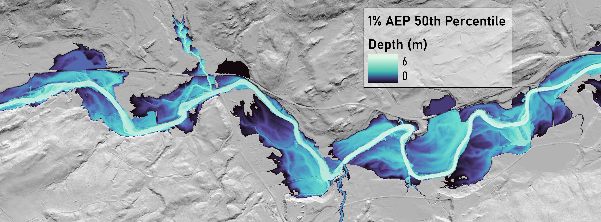
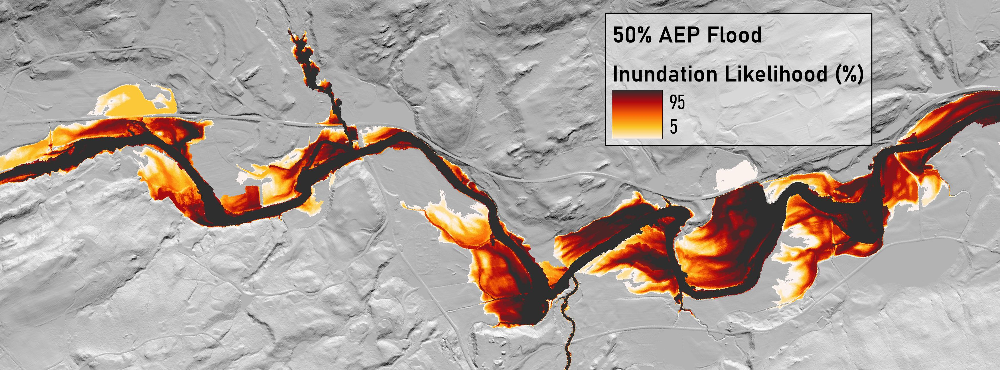

# probHAND: Low-complexity, Probabilistic Floodplain Mapping


## Overview

This repository provides model code associated with the Diehl et al., 2021 probHAND model.

<i>"As runoff patterns shift with a changing climate, it is critical to effectively communicate current and future flood risks, yet existing flood hazard maps are insufficient. Modifying, extending, or updating flood inundation extents is difficult, especially over large scales, because traditional floodplain mapping approaches are data and resource intensive. Low-complexity floodplain mapping techniques are promising alternatives, but their simplistic representation of process falls short of capturing inundation patterns in all situations or settings. To address these needs and deficiencies, we formalize and extend the functionality of the Height Above Nearest Drainage (i.e., HAND) floodplain mapping approach into the probHAND model by incorporating an uncertainty analysis. With publicly available datasets, the probHAND model can produce probabilistic floodplain maps for large areas relatively rapidly."</i>

(Diehl RM, Gourevitch JD, Drago S, Wemple BC (2021) Improving flood hazard datasets using a low-complexity, probabilistic floodplain mapping approach. PLOS ONE 16(3): e0248683. https://doi.org/10.1371/journal.pone.0248683)

## Key Features

- **Probabilistic Floodplain Mapping:** Incorporates uncertainty analysis to produce more accurate floodplain maps.
- **Scalable:** Capable of mapping large areas efficiently and with modest data requirements.
- **Topographically-Driven:** Easily incorporates new topographic data for up-to-date flood hazard mapping.

## Installation

To install and run the probHAND model, follow these steps:

1. Clone the repository:
    ```bash
    git clone https://github.com/sclaw/probHAND.git
    ```
2. Navigate to the project directory:
    ```bash
    cd probHAND
    ```
3. Create new conda environment:
    ```bash
    mamba env create -f probHAND.yml
    ```
    or
    ```bash
    conda env create -f probHAND.yml
    ```
4. Ensure that you have TauDEM installed (https://hydrology.usu.edu/taudem/taudem5/)

## Usage

Data for an example HUC-12 is provided in the samples folder.  Most of the pre-processing steps have been completed ahead of time, but the example should give an overall sense for the directory and file structures.

1. Copy the path to the data directory
2. Run the model with the following command:
    ```bash
    source/main.py -huc8 Winooski_River -huc12_list [WIN_0504] -n 1000 -percentiles [50] -resolutions [1.0] -reach_type NHD -data_folder "\path\to\samples"
    ```
3. Look in samples\Data\Winooski_River\Inundation_Rasters\dynamic\NHD\thresh_5179976\HUC12_0504 for output rasters

## Results

The probHAND model generates probabilistic floodplain maps, which can be viewed using GIS software. These maps provide detailed insights into flood risks under different scenarios, supporting flood risk management and conservation efforts.

The model outputs depth rasters for a given event and percentile.


or you can post-process the outputs and look at inundation extents across percentiles



## License

This project is licensed under the GNU General Public License - see the [LICENSE](LICENSE) file for details.

## Contact

For any questions or issues, please contact us at [Rebecca.Diehl@uvm.edu](mailto:Rebecca.Diehl@uvm.edu) and [Scott.Lawson@uvm.edu](mailto:Scott.Lawson@uvm.edu).
